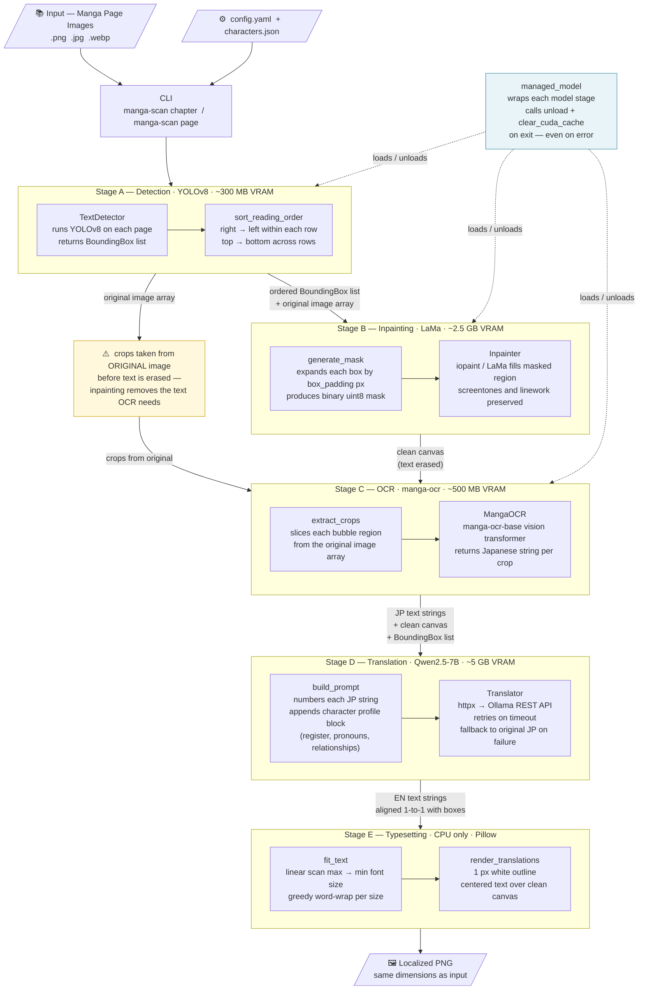
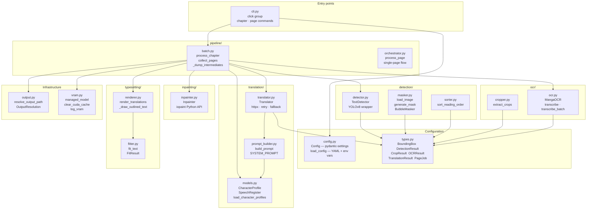

# Architecture & Pipeline Flow

## Pipeline Overview

Every chapter run passes all pages through each stage before loading the next model.
This staged design means heavy models (LaMa, Qwen) are never in VRAM at the same time.

---

## VRAM Budget (8 GB GPU)

Stages run sequentially so the two largest models never overlap.

```mermaid
gantt
    title VRAM occupancy across chapter processing
    dateFormat  X
    axisFormat  Stage %s

    section Models
    YOLOv8 — 300 MB      : active, a, 0, 1
    LaMa — 2.5 GB        : active, b, 1, 2
    manga-ocr — 500 MB   : active, c, 2, 3
    Qwen2.5-7B — 5.0 GB  : active, d, 3, 4
    Pillow (CPU)         : active, e, 4, 5
```

---

## Module Map

---

## Data Flow Between Stages

What each stage consumes and produces, per page:

| Stage | Consumes | Produces |
|---|---|---|
| **A — Detection** | image path | `DetectionResult` (ordered `BoundingBox` list) |
| **B — Inpainting** | original image array + box list → mask | clean canvas `np.ndarray` (text erased) |
| **C — OCR** | crops from **original** array (not clean canvas) | `OCRResult` list (JP string per box) |
| **D — Translation** | JP string list + character profiles | `TranslationResult` (EN string list, 1-to-1) |
| **E — Typesetting** | EN strings + boxes + clean canvas | rendered `Image` saved as PNG |

The key invariant: **OCR always reads from the original image.** The inpainted canvas has the text erased, so reversing the stage order would produce empty OCR results.
